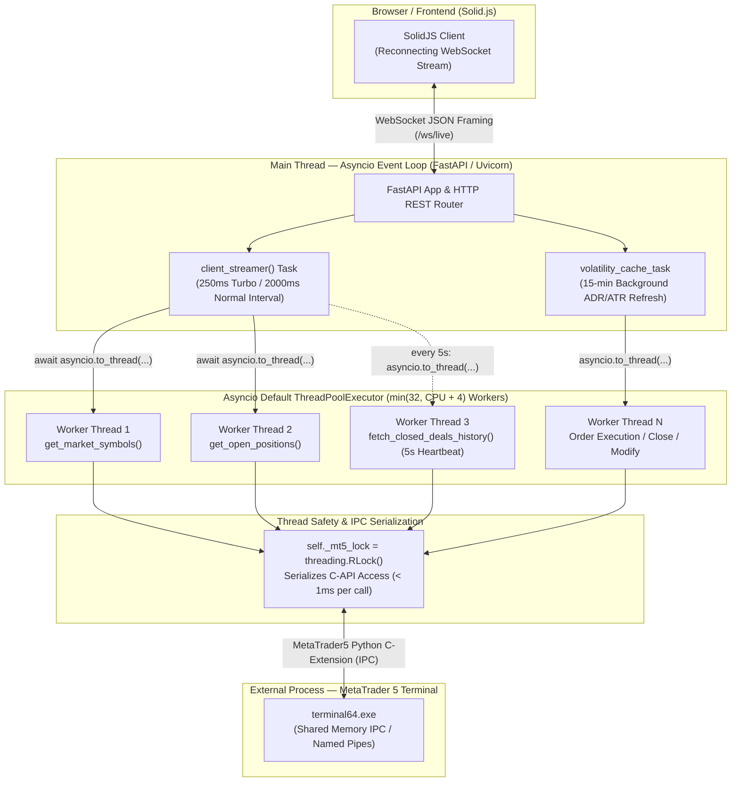

# MT5 Risk Management & Dynamic Lot Sizing Dashboard

An enterprise-grade, high-frequency risk management and real-time position sizing platform for **MetaTrader 5 (MT5)**, powered by a fine-grained reactive **Solid.js + TypeScript** frontend and a high-performance **FastAPI** backend.

> 📚 **Documentation & Architectural Research**:
> - [📖 Master Documentation Index (docs/INDEX.md)](./docs/INDEX.md) — Exhaustive research monographs, terminal design systems, cognitive ergonomics, and MT5 engineering.
> - [⚡ Quick Start & Implementation Cheat Sheet (docs/QUICK_START.md)](./docs/QUICK_START.md) — Executive summary, 90-7-3 chromatic cheat sheet, and production readiness checklist.
> - [🤖 AGENTS.md](./AGENTS.md) — Autonomous agent & developer guidelines, state architecture, reactivity rules, and design tokens.
> - [🖥️ Frontend Architecture & Ergonomics (frontend/README.md)](./frontend/README.md) — Detailed frontend architecture, component tree, execution safety ergonomics, and WebSocket API specs.
> - [🏗️ ARCHITECTURE.md](./ARCHITECTURE.md) — Deep dive into backend concurrency, ThreadPoolExecutor workers, MT5 RLock synchronization, and trade aggregation.

---

## 🌟 Key Features

1. **⚡ Fine-Grained Reactive Frontend (Solid.js + Vite + TypeScript)**:
   - **Zero Virtual DOM**: Uses pure Solid Signals (`createSignal`, `createMemo`) with microsecond direct Text/Attr node bindings (`node.data = newPrice`).
   - **Sub-Second 250ms Turbo Mode**: Streams live ticks and account balance directly over WebSocket with zero continuous HTTP recalculation round-trips.
   - **Interactive Screener Customization**:
     - **3-State Sorting**: Cycle headers through `Ascending (▲)` ➔ `Descending (▼)` ➔ `Default/None (↕)`.
     - **Symbol Pinning (`📌`)**: Lock favorite assets to the top of the matrix with `localStorage` persistence.
     - **Custom Drag & Drop Reordering (`⠿`)**: Freely reorder rows with `localStorage` persistence.
     - **↺ Reset Order**: Return instantly to default MT5 Market Watch sequence.

2. **📊 Live Order Management Panel**:
   - **Real-Time Positions Table**: Displays Ticket #, Symbol, Action (`BUY`/`SELL`), Volume, Open Price, Current Price, Floating P&L ($ and pips), and dynamic R-Multiple.
   - **One-Click Position Controls**:
     - 🛡️ **Move to Break-Even (BE)**: Instantly snaps Stop Loss to entry price with `POST /api/position/modify`.
     - ✂️ **Partial Close (50%)**: Liquidates half-position volume with `POST /api/position/close`.
     - ✕ **Instant Market Close**: Liquidates full position volume.
     - ✏️ **Inline SL/TP Modifier**: Modify stop levels directly in the table with inline validation.
     - 🛑 **Emergency Close All**: Liquidates all active positions with a single click (`POST /api/position/close-all`).

3. **🧮 Multi-Model Position Sizing Engine**:
   - **Fixed Fractional Risk**: Customizable from 0.1% to 10.0% of Working Capital.
   - **Kelly Criterion**: Full Kelly ($f^*$), Half Kelly ($f^*/2$), and Quarter Kelly ($f^*/4$).
   - **Ralph Vince Optimal $f$**: Full $f$, Half $f/2$, and Quarter $f/4$.
   - **Statistical Confidence Tiers**: Visual alerts for sample size (< 100 informational, 100–300 exploratory, 300–500 moderate, 500+ robust).

4. **🎯 Dynamic Stop Loss & Volatility Presets**:
   - In-memory 15-minute TTL cache for 14-day D1 ADR ($\text{ADR}_{14}$) and ATR ($\text{ATR}_{14}$) in pips.
   - Presets: `1/4 ADR` (default), `1/3 ADR`, `1/2 ADR`, `1.0 ADR`, `1.0 ATR`, or custom per-symbol pip overrides.

5. **🛡️ Broker Volume Clamping & Leverage Margin Health**:
   - Displays mathematical **Exact Lot** (e.g. `0.0053`) alongside broker **Executable Lot** (e.g. `0.01`).
   - Automatically computes **Effective Risk %** when minimum lot clamping increases risk exposure.
   - Real-time margin utilization % with status alerts (`healthy` / `warning` / `exceeded`).

---

## 🏛️ Backend Concurrency & Threading Architecture

See [ARCHITECTURE.md](./ARCHITECTURE.md) for full technical documentation.



### Concurrency Characteristics:
* **Zero Main Loop Blocking**: FastAPI's main async thread is never blocked by MT5 C-extension calls; all IPC queries are dispatched via `asyncio.to_thread(...)`.
* **MT5 IPC Thread Safety**: A dedicated re-entrant lock (`threading.RLock()`) ensures all C-extension calls are serialized conflict-free.
* **Positions vs. Deals Aggregation**: The dashboard aggregates raw execution deals by `position_id` into true round-turn completed trades, providing mathematically sound sample statistics for Kelly & Optimal $f$ sizing.

---

## 🚀 How to Run & Develop the Frontend

### 1. Run Production Server (FastAPI + Built Solid.js UI)

Start the backend server (automatically serves the compiled frontend from `static/dist/`):
```powershell
uv run python -m risk_management_dashboard.run
```
Or directly with Uvicorn:
```powershell
uv run uvicorn risk_management_dashboard.app:app --host 127.0.0.1 --port 8000 --reload
```
Open your browser at `http://127.0.0.1:8000`.

---

### 2. Frontend Development with Hot Module Replacement (HMR)

The frontend is colocated in `risk_management_dashboard/frontend/` with Vite proxying API and WebSocket traffic to `:8000`:

```powershell
# 1. Navigate to the frontend directory
cd risk_management_dashboard/frontend

# 2. Install dependencies (using pnpm or npm)
pnpm install
# or: npm install

# 3. Start the Vite dev server with instant HMR
pnpm dev
# or: npm run dev
```

Open `http://localhost:3000` in your browser. All UI changes will hot-reload instantly while proxying live MT5 data from FastAPI.

---

### 3. Build Frontend for Production

When you make changes to the Solid.js components and want to build the optimized production assets:

```powershell
cd risk_management_dashboard/frontend
pnpm build
# or: npm run build
```

This compiles optimized bundles to `risk_management_dashboard/static/dist/` (JavaScript ~20 KB gzipped, CSS ~4 KB gzipped), ready to be served by FastAPI.

---

## 📁 Frontend Architecture (`frontend/src/`)

```text
frontend/src/
├── types/                      # TypeScript definitions (AccountSummary, SymbolSpec, OpenPosition, TradeStats)
├── stores/                     # Fine-grained reactive stores & domain signals
│   ├── accountStore.ts         # Balance, Equity, Leverage, Margin Health, MT5 Connection
│   ├── marketStore.ts          # Live ticks, calculated symbol matrices, 3-state sorting, drag & drop
│   ├── positionsStore.ts       # Live open positions & floating P&L
│   ├── preferencesStore.ts     # User settings with localStorage persistence
│   └── toastStore.ts           # Floating notification stack
├── services/
│   ├── api.ts                  # Typed REST API client (/api/positions, /api/order/execute, etc.)
│   └── websocket.ts            # Reconnecting WebSocket client with 500ms/2000ms rate switching
├── utils/
│   ├── lotCalculator.ts        # Client-side multi-model lot sizer matching Python risk_calculator.py
│   └── formatters.ts           # Currency, percentage, and number formatters
├── components/
│   ├── header/HeaderMetricsBar.tsx      # Balance, Equity, P&L, Turbo Switch, One-Click Switch
│   ├── controls/RiskControlsBar.tsx     # Working Capital, Risk Model, SL Mode, RR Ratio
│   ├── stats/StrategyStatsBanner.tsx    # Collapsible Strategy Performance Summary
│   ├── matrix/RiskMatrixTable.tsx       # 3-State Sorting Table & Category Filter Tabs
│   ├── matrix/SymbolRow.tsx             # Microsecond Signal-bound single table row
│   ├── positions/OrderManagementPanel.tsx # Live Positions Table & Emergency Close All
│   ├── positions/PositionRow.tsx        # Row with BE snap, 50% partial close, inline SL/TP
│   ├── modals/                          # DeepDiveModal, ConfirmTradeModal, ManualStatsModal, CsvUploadModal
│   └── toasts/ToastContainer.tsx        # Toast notification stacking
├── App.tsx                     # Root Layout component
├── index.css                   # Dark Trading UI stylesheet
└── index.tsx                   # DOM mount entrypoint
```

---

## 🧪 Automated Testing

Run the full pytest test suite (17 unit and API integration tests):

```powershell
uv run pytest risk_management_dashboard/test_risk_calculator.py -v
```

